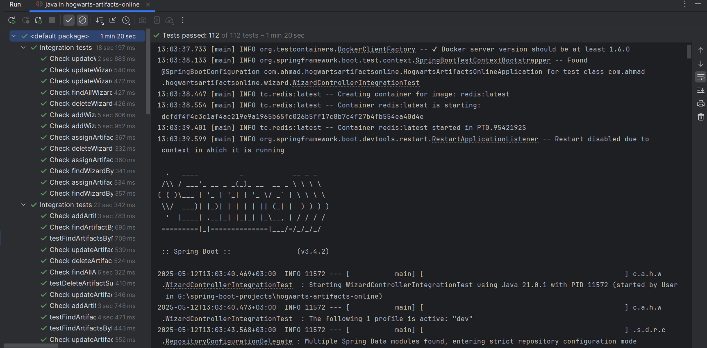
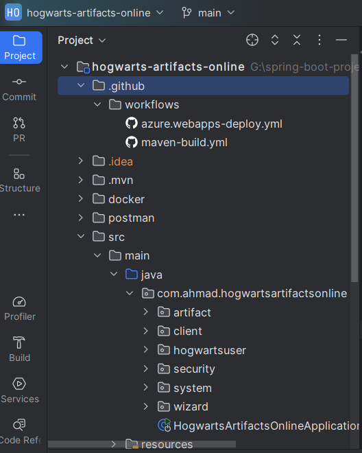
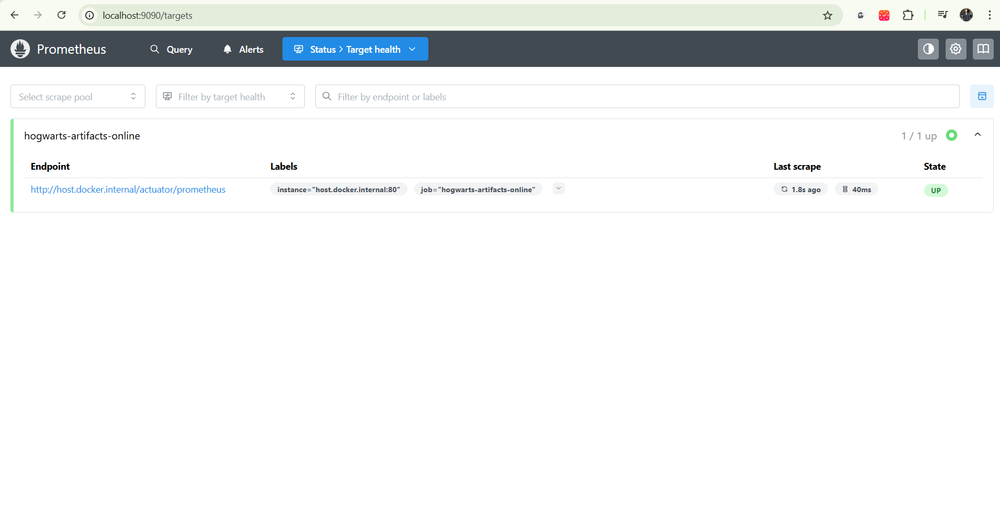
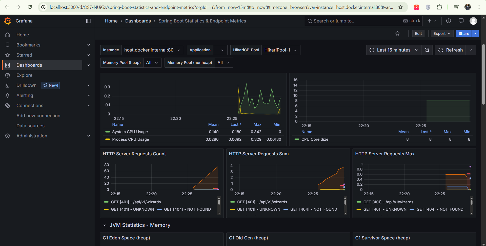
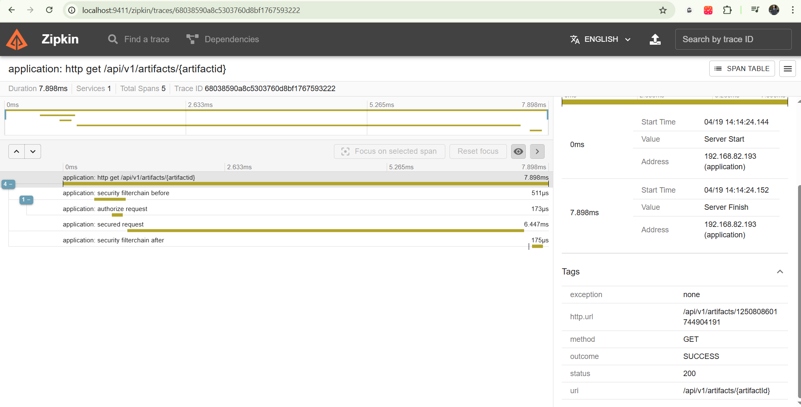
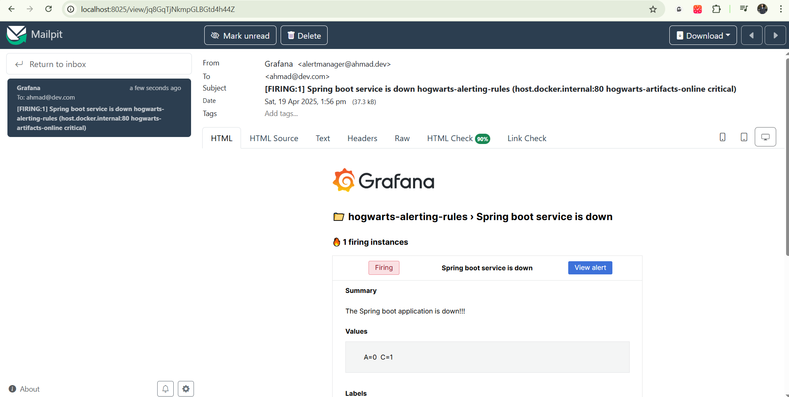

# Hogwarts Artifacts App

## Introduction

Hogwarts Artifacts App provides REST API to CRUD artifacts, wizards, and users.

## Table of Contents

- [Project structure](#project-structure)
    - [Controllers](#controllers)
    - [Services](#services)
- [Database](#database)
    - [ORM](#orm)
    - [Migration](#migration)
    - [Initial data dump in dev env](#initial-data-dump-in-dev-env)
    - [Initial data dump in prod env](#Initial-data-dump-in-prod-env)
- [API Endpoints](#api-endpoints)
- [API definitions and specific implementations](#api-definitions-and-specific-implementations)
    - [General](#general)
- [Authentication and Authorization](#authentication-and-authorization)
- [Exception handling](#exception-handling)
- [Infra](#infra)
    - [Caching](#caching)
    - [Image building](#image-building)    
    - [Image storage](#image-storage)
    - [Azure key vault](#azure-key-vault)    
- [Open Ai](#open-ai)
- [Unit and Integration Tests](#unit--integration-tests)
    - [Strategy](#strategy)
    - [Application tests](#application-tests)
- [CI/CD](#cicd)    
    - [Branching Strategy](#branching-strategy)
    - [Release workflow](#release-workflow)
- [Production recommendations](#production-recommendations)
  - [Observability](#observability)
  - [Monitoring](#monitoring)
  - [Distributed tracing](#distributed-tracing)
  - [Alerting](#alerting)  
- [Running the project](#running-the-project)
    - [Dependencies](#dependencies)
    - [Run project](#run-project)    

## Project structure

The project hierarchy adheres to standard Java package conventions, organized by package type.

```
├── src
│   ├── main
│   │   ├── java
│   │   │   └── com
│   │   │       └── ahmad
│   │   │           └── hogwartsartifactsonline
│   │   │               ├── artifact
│   │   │               ├── client
│   │   │               │     ├── ai.chat
│   │   │               │     ├── imagestorage
│   │   │               │     ├── rediscache
│   │   │               ├── hogwartsuser
│   │   │               ├── security
│   │   │               ├── system
│   │   │               │  ├── actuator
│   │   │               │  ├── exception
│   │   │               ├── wizard

```

### Controllers

They all follow the same structure:

```java

@RestController
@RequestMapping("${api.endpoint.base-url}/wizards")
public class WizardController {

    private final WizardService wizardService;
    private final WizardToWizardDtoConverter wizardToWizardDtoConverter;
    private final WizardDtoToWizardConverter wizardDtoToWizardConverter;

    public WizardController(WizardService wizardService, WizardToWizardDtoConverter wizardToWizardDtoConverter, WizardDtoToWizardConverter wizardDtoToWizardConverter) {
        this.wizardService = wizardService;
        this.wizardToWizardDtoConverter = wizardToWizardDtoConverter;
        this.wizardDtoToWizardConverter = wizardDtoToWizardConverter;
    }
}
```

They retrieve the base URL from a application.yml file, It's crucial to maintain
consistent and immutable Base Url definition.

### Services

They all follow the same structure, and I prefer to inject the repos in the constructor.

```java

@Service
@Transactional
public class WizardService {

    private final WizardRepository wizardRepository;
    private final ArtifactRepository artifactRepository;


    public WizardService(WizardRepository wizardRepository, ArtifactRepository artifactRepository) {
        this.wizardRepository = wizardRepository;
        this.artifactRepository = artifactRepository;
    }
}
```

## Database

I have two environments one for development and it uses H2 in memory database,
and the second one for Production It uses Azure Database for MySQL for persistence and Flyway for managing migrations and schema versioning.

### ORM

- Hibernate is configured to only perform schema validation to ensure data integrity.
- All transactions are set at the service layer to ensure consistency.

### Migration

- Use Flyway for automatic schema migration.

### Initial data dump in dev env

I add DBDataInitializer class which implements CommandLineRunner in system package for initial data.

```java

@Component
@Profile("dev")
public class DBDataInitializer implements CommandLineRunner {

    private final ArtifactRepository artifactRepository;
    private final WizardRepository wizardRepository;
    private final UserService userService;

    public DBDataInitializer(ArtifactRepository artifactRepository, WizardRepository wizardRepository, UserService userService) {
        this.artifactRepository = artifactRepository;
        this.wizardRepository = wizardRepository;
        this.userService = userService;
    }

    @Override
    public void run(String... args) throws Exception {


        Artifact a1 = new Artifact();
        a1.setId("1250808601744904191");
        a1.setName("Deluminator");
        a1.setDescription("A Deluminator is a device invented by Albus Dumbledore that resembles a cigarette lighter. It is used to remove or absorb (as well as return) the light from any light source to provide cover to the user.");
        a1.setImageUrl("ImageUrl");

}
```

### Initial data dump in prod env

- For the sake of simplicity I added the following entities in the initial migration:

```sql
INSERT INTO `wizard` VALUES (1,'Albus Dumbledore'),(2,'Harry Potter'),(3,'Neville Longbottom');
```

## API endpoints

### Artifact

- **Description:** Artifact-CRUD API.
- **Authorization:** Provides public facing information.
- **URL:**
    - `{{host}}/api/v1/artifacts`
        - GET - List all artifacts
        - GET - Get artifact by id
        - POST - Add artifact
        - PUT - Update artifact
        - PATCH - Patch company
        - DELETE - Delete artifact
        - POST - Search artifacts by criteria
        - GET -  Summarize artifacts

### Wizard

- **Description:** Wizard-CRUD API.
- **Authorization:** User should be authenticated to see wizards info.
- **URL:**
    - `{{host}}/api/v1/wizards`
        - GET - List all wizards
        - POST - Add wizard
        - GET - Get wizard by id
        - PUT - Update wizard
        - DELETE - Delete wizard
        - PUT - Assign artifact to wizard

### Users

- **Description:** Users-CRUD API for managing the users in the app.
- **Authorization:** It verifies restrict users to access their own data.
- **URL:**
    - `{{host}}/api/v1/users`
        - GET - List all users
        - POST - Add user
        - GET - Get wizard by id
        - PUT - Update user
        - PATCH - Change user password

## API definitions and specific implementations

### General

- API requests/responses only use the necessary information to optimize payload processing and
  network transfer costs.
- Artifact APIs use pagination to limit the response payload size.
- The maximum page size is set to 20 to prevent potential memory issues.

## Authentication and Authorization

The application implements HTTP Basic authentication.

Authorization is verified at the API entry level.

## Exception Handling

Exception handling is centralized in the `ExceptionHandlerAdvice` class to ensure consistent and
normalized error responses.

All application exceptions extend the `RuntimeException` to provide a normalized error message.

```java

@RestControllerAdvice
public class ExceptionHandlerAdvice {

    @ExceptionHandler(ObjectNotFoundException.class)
    @ResponseStatus(HttpStatus.NOT_FOUND)
    Result handleObjectNotFoundException(ObjectNotFoundException exception) {
        return new Result(false, StatusCode.NOT_FOUND, exception.getMessage());
    }

    @ExceptionHandler(AccessDeniedException.class)
    @ResponseStatus(HttpStatus.FORBIDDEN)
    Result handelAccessDeniedException(AccessDeniedException exception) {
       return new Result(false, StatusCode.FORBIDDEN, "No Permission.", exception.getMessage());
    }
}
```

Example:

```json
{
    "flag": false,
    "code": 404,
    "message": "Could not find artifact With Id 1 :(",
    "data": null
}
```

```json
{
    "flag": false,
    "code": 401,
    "message": "Login credentials are missing.",
    "data": "Full authentication is required to access this resource"
}
```

## Infra

### Caching

I implemented the password change API endpoint, set up our development environment using Docker Compose for Redis,
and implemented storing and revoking tokens in Redis.
and also covered how to use Testcontainers for integration testing and configured Azure Cache for Redis for our production environment.

### Image building

The application uses a multi-stage Docker build process to create an optimized container image:

```java
# Stage 1: Builder stage
FROM eclipse-temurin:21-jdk as builder
WORKDIR application
ARG JAR_FILE=target/*.jar
COPY ${JAR_FILE} application.jar
RUN java -Djarmode=layertools -jar application.jar extract
```

```java
# Stage 2: Runtime stage
FROM eclipse-temurin:21-jdk
WORKDIR application
COPY --from=builder application/dependencies/ ./
COPY --from=builder application/spring-boot-loader/ ./
COPY --from=builder application/snapshot-dependencies/ ./
COPY --from=builder application/application/ ./
ENTRYPOINT ["java", "org.springframework.boot.loader.launch.JarLauncher"]
```

### Image storage

Azure Blob Storage is Microsoft's object storage solution for the cloud.
I upload files to Azure Blob Storage in this project and handling exceptions
Blob Storage from production.

### Azure Key Vault

Although the H2 in-memory database comes in handy during development,
I need to switch to a beef production-ready database in production.
so I connect our application to a MySQL database hosted on Microsoft Azure.
using Azure Key Vault to securely store database login credentials.

## OpenAI

I used Spring Framework's RestClient to interact with the OpenAI API for a text summarization task.
and also cover how to unit test the RestClient.

## Unit & Integration Tests

### Strategy

I used Test-Driven Development (TDD): writing tests first, then coding to pass the tests, and refactoring.
`MockMvc` is configured for all APIs, simplifying the testing configuration process.

```java

@SpringBootTest
@Testcontainers
@AutoConfigureMockMvc
@DisplayName("Integration tests for Artifact API endpoints")
@Tag("integration")
@ActiveProfiles(value = "dev")
public class ArtifactControllerIntegrationTest {

    @Autowired
    MockMvc mvc;


    @Value("${api.endpoint.base-url}")
    String baseUrl;

    String token;

    @Container
    @ServiceConnection
    static RedisContainer redisContainer = new RedisContainer(DockerImageName.parse("redis"));

}
```

### Application tests

The api implements the following unit and integration tests:



## CI/CD

During software development, I encourage "Integrate early and integrate often.",
so I created a continuous integration workflow using GitHub Actions.

### Branching Strategy

This workflow involves managing two types of branches:

- **Long-lived branches:**
    - `main`: Always reflects the production state.

- **Short-lived branches:**
    - `feature`: Branches off from `main` for developing new features.

### Release workflow

**Development environment - Feature Development**

- Create `feature` branch from `main`.
- Open a pull request from `feature` into `main`.
    - The CI will automatically:
        - Run all tests.

**Production environment**

- Merge and close the PR `feature` into `main`.
    - The CI will automatically:
        - Skip all tests.
        - Deploy the image to prod image registry using workload identity federation.
        - Open PR to align `feature` with `main` in case modifications were made in the PR.
        - Push the app as a docker container to Azure app service.

You can have a look at their implementations:



## Production recommendations

### Observability

This project use Prometheus to Scrapes metrics from Spring Boot Actuator's /actuator/prometheus endpoint.



### Monitoring

- Use a Grafana dashboard like the one shown below to monitor your application:
- JVM performance (memory, GC, threads)
- HTTP request metrics (latency, error rates)



### Distributed tracing

- the project uses Zipkin for trace visualization.



### Alerting

- Defining alert rules in Grafana and sending alert emails to Mailpit.



## Running the project

### Dependencies

The dependencies of the project are:

* OpenJDK Java version >= 21
* [Docker](https://www.docker.com)
* [Docker Compose](https://docs.docker.com/compose/)
* [Maven](https://maven.apache.org/)

### Run project

```
.\mvnw.cmd spring-boot:run
```